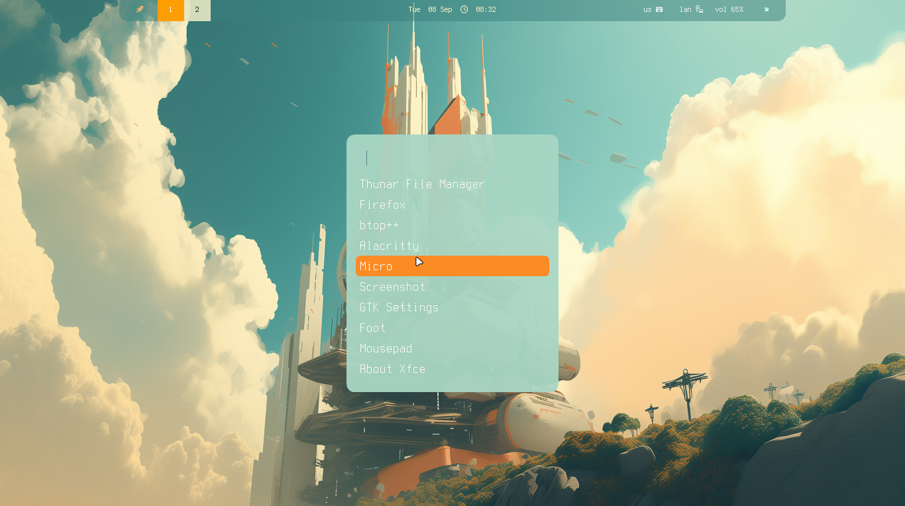
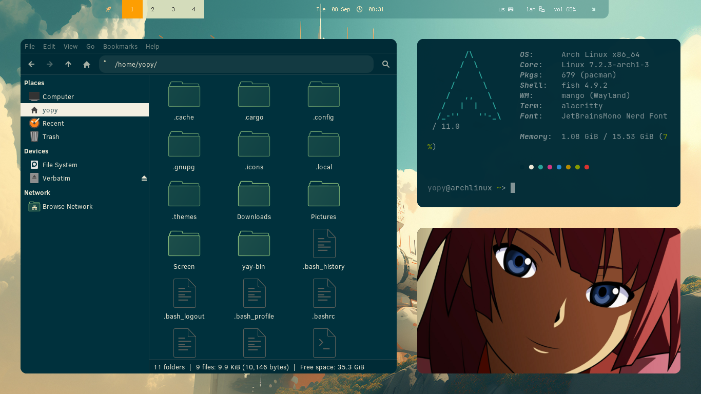
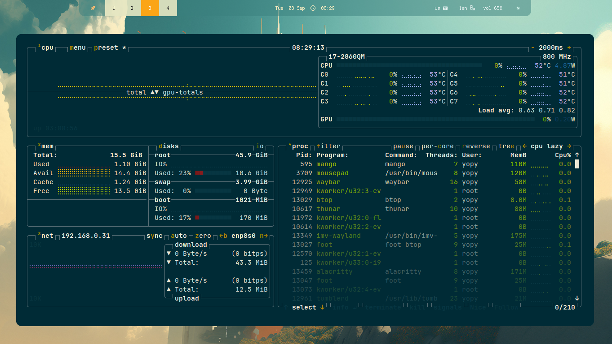
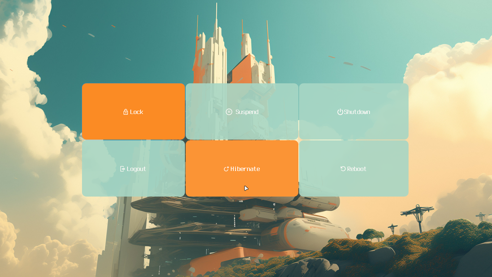

| **Window Manager**  | `mango`  |
| :----------------------------------- | :------------------------ |
| **Status bar**                       | `waybar`                  |
| **Terminal**                         | `foot`                    |
| **Launcher**                         | `fuzzel`                  |
| **Wallpaper**                        | `swaybg`                  |
| **Compositor**                       | `wayland`                 |
| **Screenshot**                       | `grim`                    |
| **Viewer**                           | `imv`                     |
| **Logout menu**                      | `wlogout`                 |

#### Fonts / Theme

**Symbols Nerd Font** - icons, interface, development.  
**JetBrains Mono** - system font and interface.

**Clear Sans 10** - System Font  
**Osaka-Dark-Solarized** - Theme  
**Gruvbox** - Icons

### 🧼 Installation

#### 1. Boot to the Arch iso

```
archinstall

on the step - profile - select > desktop > sway
```

#### 2. After installing - Reboot and update system

```
sudo pacman -Syu

sudo pacman -S \
      xorg-xwayland \
      seatd \
      polkit
```

> [!IMPORTANT]
> sudo systemctl enable --now seatd
> sudo usermod -aG seat $USER

#### 3. Installing Mango

```
sudo pacman -S --needed base-devel git
git clone https://aur.archlinux.org/paru.git
cd paru
makepkg -si

paru -Syu \
mangowm-git \      
      waybar-git \
      swaybg \
      swaylock-effects-git \
      swaync \
      sway-audio-idle-inhibit-git \
      swayidle \
      wlogout \
      foot \
      xdg-desktop-portal-wlr \
      wl-clip-persist \
      cliphist \
      wl-clipboard \
      wlsunset \
      xfce-polkit \
      pamixer \
      wlr-dpms \
      dimland-git \
      brightnessctl \
      swayosd \
      wlr-randr \
      grim \
      slurp
```

#### 4. Installing Pkgs

```
paru -S \

alacritty \
   foot \
   micro \
   mousepad \
   firefox

thunar \
   thunar-archive-plugin \
   thunar-volman \
   xfce4-screenshooter

fastfetch \
   mc \
   xarchiver \
   tumbler \
   btop

p7zip \
   unzip \
   zip \
   tar \
   atool

wget \
   git \
   curl \
   gvfs \
   udisks2 \
   ntfs-3g

xdg-utils \
   ripgrep \
   zoxide \
   eza \
   fzf \
   fd

imv \
   celluloid \
   rhythmbox \
   imagemagick \
   ffmpeg
```

#### 5. Installing FISH

```
paru -S fish 

chsh -s $(command -v fish)
```

#### Home Structure

```text
~/
├── Pictures/
├── Screen/
├── icons/
├── themes/
├── .local/share/fonts/
└── .config/
    ├── mango/
    ├── waybar/
    ├── fuzzel/
    └── foot/
```

#### Used Dots, Icons, Themes, Wallpapers

> [!NOTE]
> [yojeero/config_linux](https://github.com/yojeero/config_linux)

#### Folder for screenshots

> [!NOTE]
> Create folder **Screen** for saving screenshots via grim.

### 🐧 Login TTY

> ### Mango > use Bash or ZSH or FISH

#### .bash_profile

```
if [[ -z $DISPLAY && $XDG_VTNR -eq 1 ]]; then
  exec mango
fi
```

#### .zprofile

```
if [ -z "${DISPLAY}" ] && [ "${XDG_VTNR}" -eq 1 ]; then
  exec mango
fi
```

#### config.fish

```
if status is-login
    if test (tty) = /dev/tty1

         set -gx XDG_CURRENT_DESKTOP mango
            set -gx XDG_SESSION_DESKTOP mango
            set -gx XDG_SESSION_TYPE wayland
            set -gx MOZ_ENABLE_WAYLAND 1
            set -gx QT_QPA_PLATFORM wayland
            
            exec mango
    end
end
```

### 🐧 Login Mango

> [!TIP]
> Arch Linux > login > pass

> #### Mango + Sway 

#### config.fish

> Interactive session selection when logging into TTY1

```
if status is-interactive; and test (tty) = "/dev/tty1"
    echo "==================================="
    echo " Run Mango or Sway:   "
    echo " [1] Mango (Wayland)              "
    echo " [2] Sway (Wayland)              "
    echo " [3] Stay in TTY      "
    echo "==================================="
    
    # Read the user's choice
    read -P "Select [1-3]: " choice

    switch $choice
        case 1
            echo "Start Mango (Wayland)..."    
            set -gx XDG_CURRENT_DESKTOP mango
            set -gx XDG_SESSION_DESKTOP mango
            set -gx XDG_SESSION_TYPE wayland
            set -gx MOZ_ENABLE_WAYLAND 1
            set -gx QT_QPA_PLATFORM wayland
            
            exec mango

        case 2
            echo "Start Sway (Wayland)..."
            set -gx XDG_CURRENT_DESKTOP sway
            set -gx XDG_SESSION_DESKTOP sway
            set -gx XDG_SESSION_TYPE wayland
            set -gx MOZ_ENABLE_WAYLAND 1
            set -gx QT_QPA_PLATFORM wayland
            
            exec sway

        case 3
            echo "Enter to TTY!"
            
        case '*'
            echo "Bad step. Stay in TTY."
    end
end
```

### 🐧 Login Mango or Sway

    ├── [1] Mango (Wayland)
    ├── [2] Sway (Wayland)
    └── [3] Stay in TTY
